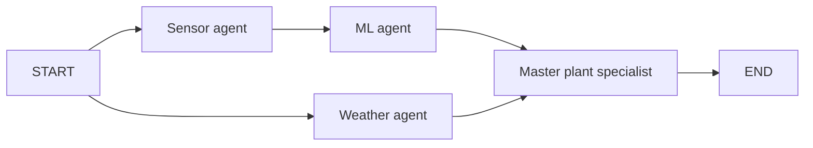

# GreenPulse AI

GreenPulse AI combines greenhouse sensor readings, machine learning anomaly detection,
and outdoor weather to provide plant-care recommendations. The project has two parts:

- **ML pipeline:** preprocess hourly sensor data, train and compare three anomaly models,
  and predict whether the latest sensor pattern is unusual.
- **AI-agent workflow:** collect sensor and weather data, run the trained model, and use
  a Groq-powered plant specialist to combine the evidence into recommendations.

The greenhouse country context is **Sri Lanka**, with `Asia/Colombo` as the default sensor
timezone. The exact location and crop details are configured locally.

## Architecture

| Agent | Responsibility |
| --- | --- |
| **1. ML agent** | Applies the trained model and reports its anomaly score, threshold, and severity |
| **2. Sensor agent** | Reads CSV or HTTP JSON data, validates readings, and checks timestamps |
| **3. Weather agent** | Fetches current outdoor conditions from OpenWeather |
| **4. Master agent** | Combines sensor, ML, weather, and crop context into plant-care recommendations using Groq |



Sensor and weather collection run concurrently. ML scoring waits for sensor data; the
master waits for both branches and runs once. The first three agents use Python for
acquisition and inference. The master uses a LangChain prompt chain with structured
Pydantic output. LangGraph manages the shared state and execution order.

## Project structure

```text
greenhouse/
├── README.md
├── .gitignore
├── .env.example                    # Configuration template
├── .env                            # Local keys and settings; ignored by Git
├── ml/
│   ├── README.md
│   ├── requirements.txt
│   ├── src/                        # Preprocessing, training, evaluation, prediction
│   ├── tests/
│   ├── notebooks/                  # Exploratory data analysis
│   ├── data/                       # Local raw, processed, and split datasets
│   ├── models/                     # Local trained weights, scalers, and metadata
│   └── results/                    # Local evaluation and validation reports
└── ai-agent/
    ├── README.md
    ├── requirements.txt
    ├── example.py                  # Full workflow CLI
    ├── greenhouse_agents/          # Clients, schemas, nodes, and workflow
    ├── topics/                     # Five standalone examples with notes
    ├── examples/                   # Trackable sample inputs
    ├── tests/
    └── results/                    # Local generated reports
```

Datasets, trained models, generated reports, virtual environments, and `.env` are ignored
by Git. A fresh clone needs its own data and model artifacts. Source code, notebooks,
examples, and `.env.example` remain trackable.

## Setup

Use **Python 3.12** to match the validated environment. Run the commands below from the
project root.

```bash
python -m venv .venv
source .venv/bin/activate
pip install -r ai-agent/requirements.txt
```

The agent requirements include the ML requirements, so one environment can run both
parts. For an ML-only installation, use `pip install -r ml/requirements.txt` instead.

On this workspace, `ml/.venv` already contains the validated dependencies. You can
activate it with `source ml/.venv/bin/activate` instead of creating another environment.

If `.env` does not exist, create it from the template:

```bash
cp .env.example .env
```

Edit the existing file when it already contains your settings. Configure these values
for the live agent workflow:

| Variable | Purpose | Default / requirement |
| --- | --- | --- |
| `GROQ_API_KEY` | Groq credentials for the master agent | Required for recommendations |
| `GROQ_MODEL` | Groq model ID | `openai/gpt-oss-120b` |
| `OPENWEATHER_API_KEY` | OpenWeather credentials | Required for live weather |
| `GREENHOUSE_LATITUDE` | Exact greenhouse latitude | Required for live weather |
| `GREENHOUSE_LONGITUDE` | Exact greenhouse longitude | Required for live weather |
| `SENSOR_SOURCE` | Sensor input transport | `csv` or `http`; defaults to `csv` |
| `SENSOR_CSV_PATH` | Sensor CSV path | `readings.csv` |
| `SENSOR_API_URL` | HTTP sensor endpoint | Required when using `http` |
| `SENSOR_API_KEY` | Optional sensor API Bearer token | Blank by default |
| `SENSOR_TIMEZONE` | Timezone for readings without an offset | `Asia/Colombo` |
| `MAX_SENSOR_AGE_MINUTES` | Age above which readings are flagged as stale | `120` |
| `ML_MODEL` | Anomaly model used by the agents | `autoencoder` |
| `CROP_NAME` | Crop being grown | Blank becomes `unspecified` |
| `GROWTH_STAGE` | Crop growth stage | Blank becomes `unspecified` |
| `GROWING_MEDIUM` | Soil, substrate, or other growing medium | Blank becomes `unspecified` |
| `REQUEST_TIMEOUT_SECONDS` | External request timeout | `30` |

Enter numeric coordinates for your greenhouse; the workflow does not choose a city from
“Sri Lanka.” Missing crop context is reported to the master rather than filled with
assumed crop targets. Process environment variables override `.env` values. Relative
sensor paths in `.env` resolve from the project root.

## Prepare and train the models

If trained artifacts are already available in `ml/models/`, skip training and continue
to prediction. Otherwise, place the source workbook in `ml/data/raw/`, for example
`hrzsi_dataset_and_analysis.xlsx`.

The workbook should contain the `Object_df_raw` sheet with these columns:
`DATE`, `Air temperature (°C)`, `Relative humidity (%)`, `SMC1`, `Ts1`, `SMC2`, and `Ts2`.

```bash
python ml/src/preprocess.py
python ml/src/feature_engineering.py
python ml/src/hyperparameter.py --quick
python ml/src/train_isolation_forest.py
python ml/src/train_autoencoder.py
python ml/src/train_lstm_autoencoder.py
python ml/src/evaluate_models.py
python ml/src/select_best_model.py
```

Preprocessing rounds timestamps to hours, validates sensor ranges, removes duplicate
or invalid rows, and splits data chronologically into **70% train / 15% validation /
15% test**. Feature engineering expands the six sensor values into **13 model features**.
Scalers fit only training data. LSTM windows exclude gaps in the hourly timestamps.

Remove `--quick` for the wider tuning search. Dense and LSTM training use up to 80 and
70 epochs respectively, with early stopping. For a smoke run, use
`python ml/src/train_autoencoder.py --epochs 3`; reduced-epoch runs overwrite the model
artifacts and are intended for checking execution rather than final training.

Each trained model directory contains its `metadata.json`, `scaler.joblib`, and either
`model.joblib` for Isolation Forest or `model.pt` for the PyTorch autoencoders. Evaluation
writes `ml/results/evaluation/model_comparison.csv`; selection writes
`ml/models/selected_model.json`.

## Sensor inputs

Both dense-autoencoder prediction and the agent workflow accept these seven fields:

| Field | Meaning / unit |
| --- | --- |
| `timestamp` | Reading date and time; explicit timezone offset preferred |
| `air_temp_c` | Air temperature, °C |
| `humidity` | Relative humidity, % |
| `soil_moisture_l1` | Soil moisture at sensor layer 1, % |
| `soil_temp_l1_c` | Soil temperature at sensor layer 1, °C |
| `soil_moisture_l2` | Soil moisture at sensor layer 2, % |
| `soil_temp_l2_c` | Soil temperature at sensor layer 2, °C |

Create `readings.csv` with this format, replacing the sample timestamp and values with
actual observations:

```csv
timestamp,air_temp_c,humidity,soil_moisture_l1,soil_temp_l1_c,soil_moisture_l2,soil_temp_l2_c
2026-10-06T12:00:00+05:30,30.2,78.5,35.4,26.8,46.5,26.7
```

One row is enough for the dense autoencoder and Isolation Forest. The LSTM requires its
configured consecutive hourly window; the current trained model uses **12 readings**.
The model metadata determines that window length and it can change after tuning.

Features and scaling are computed automatically. With multiple rows, prediction scores
the latest observation or latest complete LSTM window. Sensor calibration and units must
match the training data.

For an HTTP sensor source, set `SENSOR_SOURCE=http` and `SENSOR_API_URL`. Its GET response
can be a single reading object, a list of readings, or `{"readings": [...]}` using the
same field names. If configured, `SENSOR_API_KEY` is sent as a Bearer token. MQTT is not
implemented in the current sensor client.

## Run anomaly prediction

Score readings using the dense autoencoder:

```bash
python ml/src/predict_anomaly.py readings.csv --model autoencoder
```

The JSON response includes `model`, `timestamp`, `score`, `threshold`, `is_anomaly`, and
`severity` (`normal`, `moderate`, or `high`). A score above the saved threshold is flagged
as an anomaly. Scores are not probabilities and are not directly comparable across models.

The prediction script supports `--model isolation_forest` and `--model lstm_autoencoder`.
Without `--model`, it uses the saved selected model, falling back to Isolation Forest if
there is no selection file. The agent workflow defaults separately to `ML_MODEL=autoencoder`.

## Run the four-agent workflow

After training or restoring model artifacts, test the graph without API keys:

```bash
python ai-agent/example.py --demo --dry-run
```

This uses explicitly simulated sensor/weather inputs and the **real trained ML model**.
The master assembles the evidence without calling Groq or generating recommendations.
`--dry-run` alone disables only Groq; use `--demo --dry-run` to avoid both external APIs.

With API keys, coordinates, and fresh sensor readings configured, run live recommendations:

```bash
python ai-agent/example.py --sensor-csv readings.csv
```

To use the sensor source configured in `.env`:

```bash
python ai-agent/example.py
```

Save a report and the graph's Mermaid source:

```bash
python ai-agent/example.py --sensor-csv readings.csv \
  --output ai-agent/results/assessment.json \
  --graph ai-agent/results/workflow.mmd
```

The output contains `sensor_report`, `ml_report`, `weather_report`, `master_report`, and
execution `history`. Master advice includes a summary, prioritized actions, reasons,
evidence sources, missing information, and cautions. Invalid or unavailable inputs
produce explicit failure reports; the CLI exits with status 1 when a required agent fails.

## Recorded model performance

The validated run used **3,798 training rows, 814 validation rows, and 814 test rows**.
Tuning used the quick search. LSTM evaluation had 803 complete test windows.

| Model | Synthetic ROC-AUC | Precision | Recall | F1 |
| --- | ---: | ---: | ---: | ---: |
| Isolation Forest | 0.643 | 40.0% | 61.9% | 0.486 |
| Dense Autoencoder | **0.963** | **71.4%** | **93.9%** | **0.811** |
| LSTM Autoencoder | 0.618 | 39.5% | 15.0% | 0.217 |

The dense autoencoder was selected. These metrics measure injected synthetic anomalies
against observed data assumed normal; the dataset has no ground-truth anomaly labels.
They do not establish real-world detection accuracy. The selected model flagged about
**18.8% of observed test readings**, so its operational threshold needs validation against
labeled greenhouse incidents.

OpenWeather provides current **outdoor** conditions, not indoor readings or a forecast.
The master is instructed to account for stale readings, time mismatches, and missing crop
context. An ML alert does not diagnose a plant disease. This workflow produces advice and
has no actuator controls.

## Validation

```bash
OMP_NUM_THREADS=2 MKL_NUM_THREADS=2 python -m unittest discover -s ml/tests -v
OMP_NUM_THREADS=2 MKL_NUM_THREADS=2 python -m unittest discover -s ai-agent/tests -v
```

The validated workspace passed **6 ML tests, 11 agent tests, and all 5 topic examples**.
Checks cover chronological splits, feature/scaler consistency, saved-model predictions,
input validation, timezone handling, HTTP contracts, branch synchronization, failure
reports, and Groq structured-output parsing with mocked HTTP. The dense-model integration
test is skipped when its trained artifact is absent.

Live Groq and OpenWeather calls still require user credentials and have not been verified
with real keys. Local validation reports are generated under `ml/results/` and
`ai-agent/results/`.

## Detailed documentation

- [ML setup, training, and prediction](ml/README.md)
- [Agent setup, configuration, and input contracts](ai-agent/README.md)
- [ML-agent example](ai-agent/topics/01-ml-agent/README.md)
- [Sensor-agent example](ai-agent/topics/02-sensor-agent/README.md)
- [Weather-agent example](ai-agent/topics/03-weather-agent/README.md)
- [Master-agent example](ai-agent/topics/04-master-agent/README.md)
- [Complete workflow example](ai-agent/topics/05-greenhouse-workflow/README.md)

The agent structure follows the runnable examples in
[langgraph-workflow-lab](https://github.com/chanupadeshan/langgraph-workflow-lab) and
[langchain-learning-lab](https://github.com/chanupadeshan/langchain-learning-lab).
