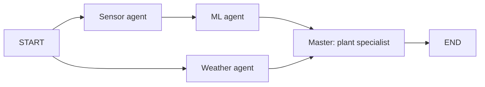

# GreenPulse AI agents

Four cooperating LangGraph agents combine greenhouse readings, the trained ML model,
OpenWeather observations, and Groq plant-specialist advice. This follows the learning
labs' `TypedDict` state → node functions → graph edges → compile → invoke pattern,
with standalone topic examples and notes. The master uses the same
`ChatPromptTemplate | ChatGroq.with_structured_output(...)` approach as the LangChain lab.

| Agent | Responsibility | Implementation |
| --- | --- | --- |
| 1. ML agent | Score the latest sensor observation with the saved dense autoencoder by default | Existing feature engineering, scaler and trained model |
| 2. Sensor agent | Retrieve, validate, timestamp and summarize readings | CSV or HTTP JSON |
| 3. Weather agent | Retrieve current outdoor conditions for the greenhouse location | OpenWeather current weather API |
| 4. Master agent | Combine the three reports and crop context into prioritized recommendations | Groq + validated Pydantic output |

The first three agents perform acquisition and inference in Python. The master performs
LLM reasoning. Sensor and weather collection run concurrently; ML depends on sensor data.
The master runs once after ML and weather have completed, including explicit failure reports.



## Project structure

```text
ai-agent/
├── example.py                   # Complete workflow CLI
├── requirements.txt
├── greenhouse_agents/
│   ├── config.py                # .env configuration
│   ├── schemas.py               # Sensor and recommendation schemas
│   ├── state.py                 # TypedDict graph state and history reducer
│   ├── sensors.py               # CSV / HTTP sensor client
│   ├── ml.py                    # Bridge to the existing trained ML pipeline
│   ├── weather.py               # OpenWeather client
│   ├── master.py                # Groq plant specialist prompt chain
│   ├── agents.py                # Four node functions and failure reports
│   ├── workflow.py              # StateGraph construction
│   ├── cli.py
│   ├── demo.py                  # Clearly marked simulated inputs
│   └── topic_runner.py
├── topics/
│   ├── 01-ml-agent/
│   ├── 02-sensor-agent/
│   ├── 03-weather-agent/
│   ├── 04-master-agent/
│   └── 05-greenhouse-workflow/
├── examples/                    # Example CSV and weather response
└── tests/
```

The project-root `.env` holds local settings; `.env.example` is safe to commit.

## Setup

Run from the greenhouse project root:

```bash
python -m venv ai-agent/.venv
source ai-agent/.venv/bin/activate
pip install -r ai-agent/requirements.txt
```

An environment at `ml/.venv` was used to verify this implementation and also contains
the agent dependencies. You can use `ml/.venv/bin/python` directly instead of creating another.

Edit the existing project-root `.env`. If setting up a fresh clone, copy `.env.example`
to `.env` first. Required live settings are:

```dotenv
GROQ_API_KEY=your_groq_key
GROQ_MODEL=openai/gpt-oss-120b
OPENWEATHER_API_KEY=your_openweather_key
GREENHOUSE_LATITUDE=your_greenhouse_latitude
GREENHOUSE_LONGITUDE=your_greenhouse_longitude
SENSOR_SOURCE=csv
SENSOR_CSV_PATH=readings.csv
SENSOR_TIMEZONE=Asia/Colombo
ML_MODEL=autoencoder
CROP_NAME=your_crop
GROWTH_STAGE=your_growth_stage
GROWING_MEDIUM=your_growing_medium
```

Sri Lanka is the country context. Enter exact greenhouse coordinates: the application
does not guess a location from the country. Coordinates must be numeric. Crop fields
can stay blank, but advice will request those details instead of assuming crop targets.
Process environment variables take precedence over `.env`. Relative CSV paths in `.env`
resolve from the project root. `--env-file PATH` selects another configuration file.

The trained artifacts must exist in `ml/models/`. They are ignored by Git; after cloning,
restore them locally or follow [the ML training instructions](../ml/README.md).

## Run the full workflow

Validate the graph with simulated sensors/weather and the real dense autoencoder,
without sending anything to Groq or OpenWeather:

```bash
ml/.venv/bin/python ai-agent/example.py --demo --dry-run
```

Generate recommendations from real sensor data and live OpenWeather:

```bash
ml/.venv/bin/python ai-agent/example.py --sensor-csv readings.csv
```

Use the configured HTTP sensor source:

```bash
ml/.venv/bin/python ai-agent/example.py
```

Save the JSON report and graph source:

```bash
ml/.venv/bin/python ai-agent/example.py --sensor-csv readings.csv \
  --output ai-agent/results/assessment.json --graph ai-agent/results/workflow.mmd
```

`--demo` uses simulated sensor/weather readings, marks both as examples, and keeps ML
inference real. Without `--dry-run`, it still calls Groq and needs a Groq key.
`--dry-run` only disables Groq; real sensor/weather clients still run unless `--demo` is supplied.
The demo contains one reading, so use the dense autoencoder or Isolation Forest.
`--model lstm_autoencoder` requires the model's full consecutive hourly window from real input.
The CLI exits with status 1 if a required agent fails; available reports are still printed.

## Sensor contract

CSV example:

```csv
timestamp,air_temp_c,humidity,soil_moisture_l1,soil_temp_l1_c,soil_moisture_l2,soil_temp_l2_c
2026-10-06T12:00:00+05:30,30.2,78.5,35.4,26.8,46.5,26.7
```

Temperatures are in °C; humidity and soil moisture are percentages. Inputs must be
calibrated consistently with the ML training data. One row is enough for the dense
autoencoder. Multiple rows are sorted and the latest is scored. Missing fields, invalid
timestamps, nonfinite values, and duplicate timestamps produce an explicit sensor error.
Readings older than `MAX_SENSOR_AGE_MINUTES` (default 120) are flagged as stale.
Naive timestamps use `SENSOR_TIMEZONE`; all report timestamps are converted to UTC.
The ML bridge converts timestamps back to local sensor time for hour-of-day features.

For an HTTP sensor API, configure:

```dotenv
SENSOR_SOURCE=http
SENSOR_API_URL=http://your-device-or-server/readings
SENSOR_API_KEY=
```

If provided, the key is sent as `Authorization: Bearer <key>`. The GET endpoint must return
a single reading object, a list of reading objects, or `{"readings": [...]}`. Each reading
uses the same seven field names as the CSV. MQTT and vendor-specific payload mappings are
not configured; adapt `SensorClient` if your hardware uses a different protocol.

## Output and limits

The report includes `sensor_report`, `ml_report`, `weather_report`, `master_report`, and
execution `history`. Master recommendations contain priority, action, reason, and evidence
sources, plus missing information and cautions. Errors omit exception messages and request
URLs to avoid exposing API keys. Full raw sensor history is omitted from CLI output.

OpenWeather returns current outdoor weather, not indoor measurements or a forecast. The
master is told to flag stale/misaligned/example data and to request missing crop context.
An anomaly score is a pattern alert, not a disease diagnosis or probability. ML thresholds
were evaluated with synthetic anomalies; real-world accuracy remains unverified. This
workflow gives advice and has no irrigation, fan, or other actuator controls.

## Checks

```bash
OMP_NUM_THREADS=2 MKL_NUM_THREADS=2 ml/.venv/bin/python -m unittest discover -s ai-agent/tests -v
```

Tests use mocked HTTP/Groq responses, check branch synchronization and failures, and
exercise the actual dense autoencoder when trained artifacts are present. Live Groq and
OpenWeather calls require your credentials and have not been verified with a real key.

## References

- [LangGraph workflow lab](https://github.com/chanupadeshan/langgraph-workflow-lab): parallel nodes, multi-field state, and LLM nodes.
- [LangChain learning lab](https://github.com/chanupadeshan/langchain-learning-lab): prompt chains, Groq, and structured output.
- [LangGraph graph API](https://docs.langchain.com/oss/python/langgraph/graph-api)
- [ChatGroq integration](https://docs.langchain.com/oss/python/integrations/chat/groq)
- [Groq models](https://console.groq.com/docs/models)
- [OpenWeather current weather](https://openweathermap.org/api/current)
